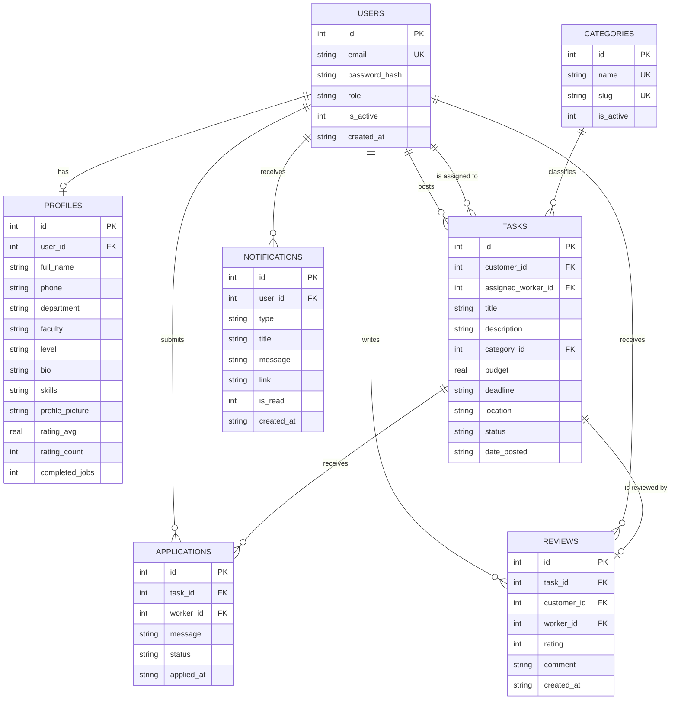

# Entity-Relationship Diagram

## Relationship summary

- A **user** has exactly one **profile** (created at signup).
- A **user** with role `customer` posts many **tasks**; a **user** with role `worker` may be assigned to
  many tasks (`tasks.assigned_worker_id`).
- A **task** belongs to exactly one **category**.
- A **task** receives many **applications** (one per worker, enforced by a unique constraint).
- A **task** has at most one **review**, written by its customer once the task is completed.
- A **user** accumulates **notifications** generated by task/application/review events involving them.
